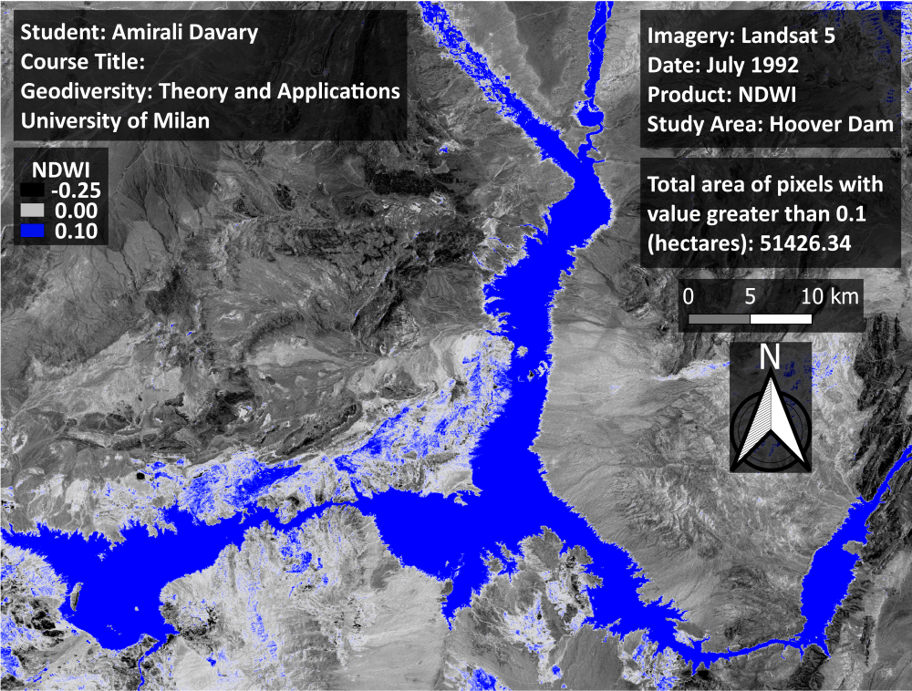
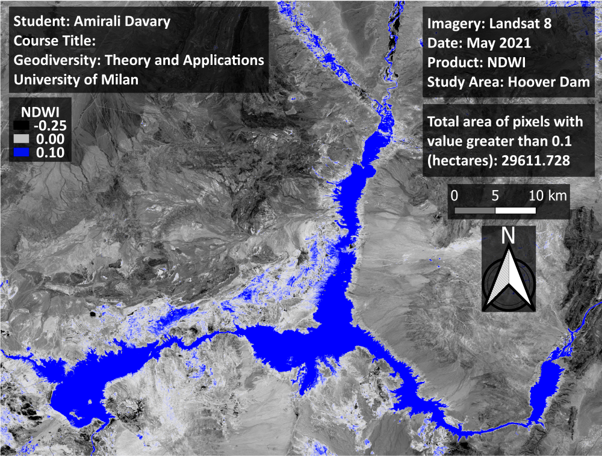

# Graduate Course Project, University of Milan

## Geodiversity: Theory and Applications

This code is developed in ***Google Earth Engine JavaScript API*** to monitor Hoover dam lake area changes over 20 years (1992 - 2021) located in Nevada, US.

Note: Use the imports.js file for visual parameters setup and definition of the dam lake area frame.

A brief visual report is available in PDF format.

### Dam lake extent in July 1992

### Dam lake extent in May 2021

